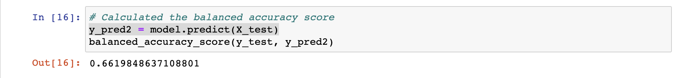
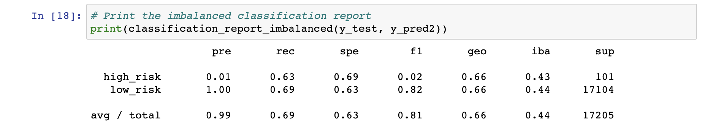
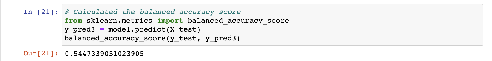
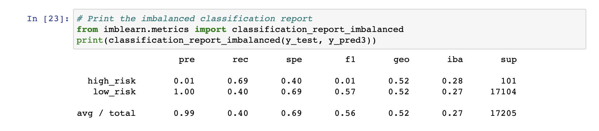
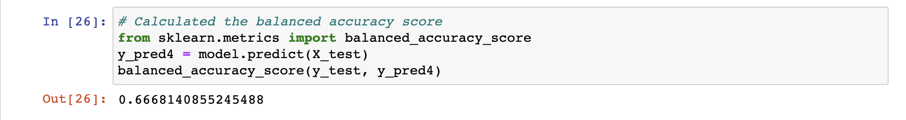
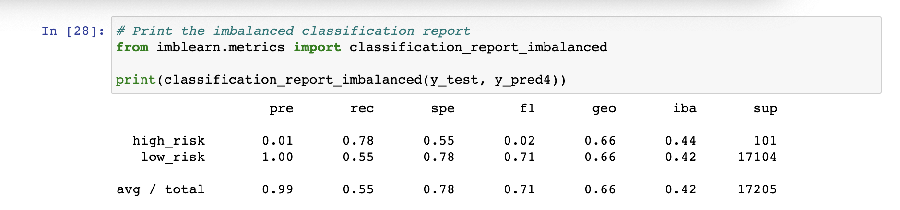
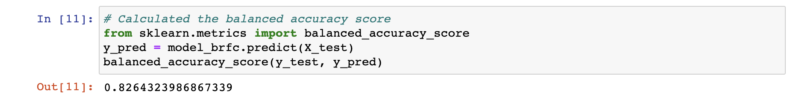
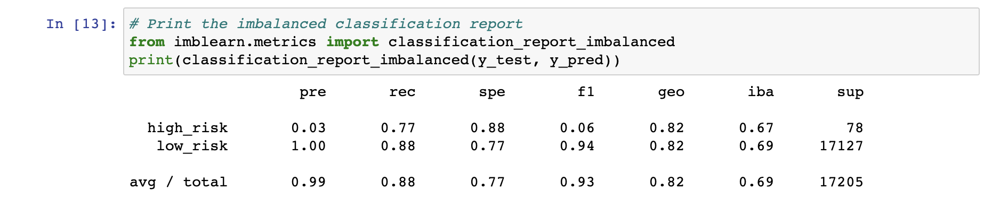
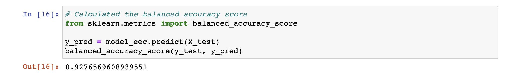
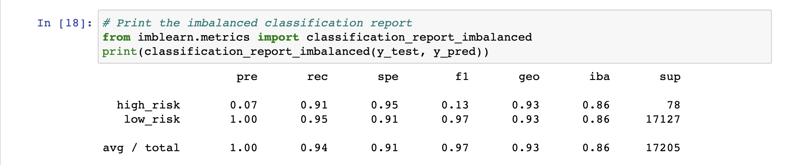

# Overview

The purpose of this analysis was to create a supervised machine learning model that could accurately predict credit risk. The following methods were used:

* Oversampling using the RandomOverSampler and SMOTE algorithms.
* Undersampling using the ClusterCentroids algorithm.
* Combined approach of over/undersampling using the SMOTEENN algorithm.
* Compare two machine learning models BalancedRandomForestClassifier and EasyEnsembleClassifier to reduce bias.

# Results

## Deliverable 1: Use Resampling Models to Predict Credit Risk

Model: Random Over Sampler

* Balanced Accuracy Score: 65.71%

* Precision Score: 
  * High Risk: 0.01
  * Low RisK: 1.00

* Recall Score:
  * High Risk: 0.71
  * Low RisK: 0.60

Model: SMOTE

* Balanced Accuracy Score: 66.19%

* Precision Score:
  * High Risk: 0.01
  * Low RisK: 1.00

* Recall Score:
  * High Risk: 0.63
  * Low RisK: 0.69

Model: ClusterCentroids

* Balanced Accuracy Score: 54.47%

* Precision Score:
  * High Risk: 0.01
  * Low RisK: 1.00

* Recall Score:
  * High Risk: 0.69
  * Low RisK: 0.40

## Deliverable 2: Use the SMOTEENN Algorithm to Predict Credit Risk

SMOTEENN Model

* Balanced Accuracy Score: 66.68%

* Precision Score:
  * High Risk: 0.01
  * Low RisK: 1.00

* Recall Score:
  * High Risk: 0.78
  * Low RisK: 0.55

## Deliverable 3: Use Ensemble Classifiers to Predict Credit Risk

Balanced Random Forest Classifier

* Balanced Accuracy Score: 82.64%

* Precision Score:
  * High Risk: 0.03
  * Low RisK: 1.00

* Recall Score:
  * High Risk: 0.77
  * Low RisK: 0.88

Easy Ensemble Classifer

* Balanced Accuracy Score: 92.76%

* Precision Score:
  * High Risk: 0.07
  * Low RisK: 1.00

* Recall Score:
  * High Risk: 0.91
  * Low RisK: 0.95

# Summary

* Deliverable 4 is this README.md file.
